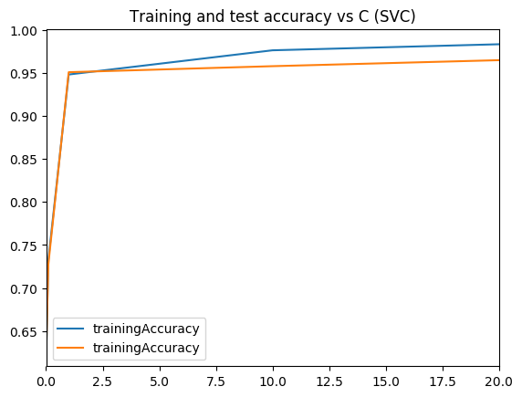
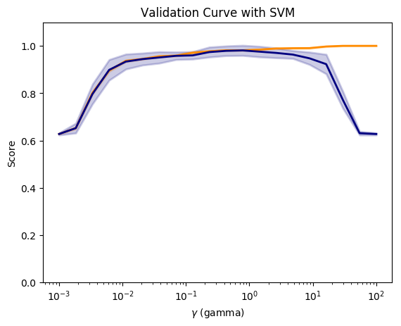
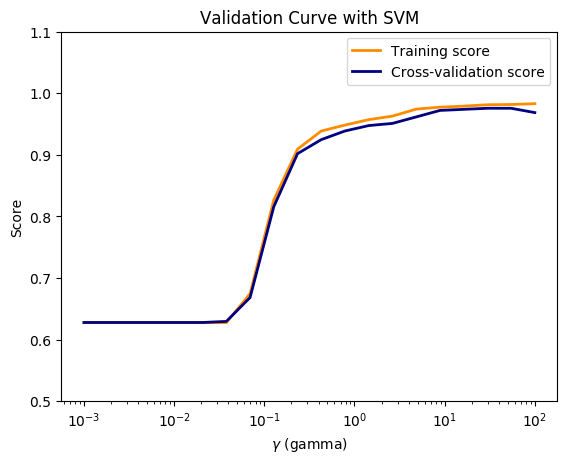
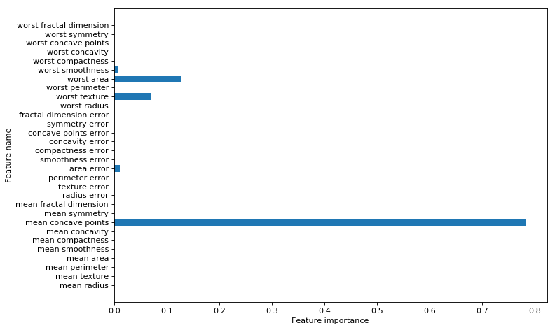

## 1.1 a. Linear SVM - R
```{r}
source('RFunctions-1.R')
library(dplyr)
library(e1071)
library(caret)
library(reshape2)
library(ggplot2)

cancer <- read.csv("cancer.csv")
#names(cancer) <- c(seq(1,30),"output")
cancer$target <- as.factor(cancer$target)

####################################
#2 Plain SVM
train_idx <- trainTestSplit(cancer,trainPercent=75,seed=5)
train <- cancer[train_idx, ]
test <- cancer[-train_idx, ]

svmfit=svm(target~., data=train, kernel="linear",scale=FALSE)
ypred=predict(svmfit,test)
confusionMatrix(ypred,test$target)

```

## 1.1b Linear SVM - Python
```{python}
import numpy as np
import pandas as pd
import os
import matplotlib.pyplot as plt
from sklearn.model_selection import train_test_split
from sklearn.svm import LinearSVC

from sklearn.datasets import make_classification, make_blobs

from sklearn.metrics import confusion_matrix
from matplotlib.colors import ListedColormap
from sklearn.datasets import load_breast_cancer
# Load the cancer data
(X_cancer, y_cancer) = load_breast_cancer(return_X_y = True)
X_train, X_test, y_train, y_test = train_test_split(X_cancer, y_cancer,
                                                   random_state = 0)
clf = LinearSVC().fit(X_train, y_train)
print('Breast cancer dataset')
print('Accuracy of Linear SVC classifier on training set: {:.2f}'
     .format(clf.score(X_train, y_train)))
print('Accuracy of Linear SVC classifier on test set: {:.2f}'
     .format(clf.score(X_test, y_test)))
```


## Dummy classifier
```{r}

DummyClassifierRsquared <- function(train,test,type="majority"){
  if(type=="majority"){
      count <- sum(train$target==1)/dim(train)[1]
  }
  count
}


cancer <- read.csv("cancer.csv")
cancer$target <- as.factor(cancer$target)

####################################
#2 Plain SVM
train_idx <- trainTestSplit(cancer,trainPercent=75,seed=5)
train <- cancer[train_idx, ]
test <- cancer[-train_idx, ]

#Dummy classifier majoritrity class

DummyClassifierRsquared(train,test)
```


```{python}
import numpy as np
import pandas as pd
import os
import matplotlib.pyplot as plt
from sklearn.datasets import load_breast_cancer
from sklearn.model_selection import train_test_split
from sklearn.dummy import DummyClassifier
from sklearn.metrics import confusion_matrix
(X_cancer, y_cancer) = load_breast_cancer(return_X_y = True)
X_train, X_test, y_train, y_test = train_test_split(X_cancer, y_cancer,
                                                   random_state = 0)

# Negative class (0) is most frequent
dummy_majority = DummyClassifier(strategy = 'most_frequent').fit(X_train, y_train)
# Therefore the dummy 'most_frequent' classifier always predicts class 0
y_dummy_predictions = dummy_majority.predict(X_test)

print('Dummy classifier accuracy on test set: {:.2f}'
     .format(dummy_majority.score(X_test, y_test)))


```

##1.2a - Radial SVM (nnormlaized) - R 
```{r}
library(dplyr)
library(e1071)
library(caret)
library(reshape2)
library(ggplot2)

# Radial SVM unnormalized
train_idx <- trainTestSplit(cancer,trainPercent=75,seed=5)
train <- cancer[train_idx, ]
test <- cancer[-train_idx, ]
# Unnormalized data
svmfit=svm(target~., data=train, kernel="radial",cost=10,scale=FALSE)
ypred=predict(svmfit,test)
confusionMatrix(ypred,test$target)
```
Python - Unnormalized
```{python}
import numpy as np
import pandas as pd
import os
import matplotlib.pyplot as plt
from sklearn.datasets import load_breast_cancer
from sklearn.model_selection import train_test_split
from sklearn.svm import SVC

# Load the cancer data
(X_cancer, y_cancer) = load_breast_cancer(return_X_y = True)
X_train, X_test, y_train, y_test = train_test_split(X_cancer, y_cancer,
                                                   random_state = 0)


clf = SVC(C=10).fit(X_train, y_train)
print('Breast cancer dataset (unnormalized features)')
print('Accuracy of RBF-kernel SVC on training set: {:.2f}'
     .format(clf.score(X_train, y_train)))
print('Accuracy of RBF-kernel SVC on test set: {:.2f}'
     .format(clf.score(X_test, y_test)))
```
##1.2a - Radial SVM -R Normalized


```{r}
trainingAccuracy <- NULL
testAccuracy <- NULL
C1 <- c(.01,.1, 1, 10, 20)
for(i in  C1){
  
    svmfit=svm(target~., data=train, kernel="radial",cost=i,scale=TRUE)
    ypredTrain <-predict(svmfit,train)
    ypredTest=predict(svmfit,test)
    a <-confusionMatrix(ypredTrain,train$target)
    b <-confusionMatrix(ypredTest,test$target)
    trainingAccuracy <-c(trainingAccuracy,a$overall[1])
    testAccuracy <-c(testAccuracy,b$overall[1])
    
}
print(trainingAccuracy)
print(testAccuracy)
a <-rbind(C1,as.numeric(trainingAccuracy),as.numeric(testAccuracy))
b <- data.frame(t(a))
names(b) <- c("C1","trainingAccuracy","testAccuracy")
df <- melt(b,id="C1")
ggplot(df) + geom_line(aes(x=C1, y=value, colour=variable),size=2) +
    xlab("C (SVC regularization)value") + ylab("Accuracy") +
    ggtitle("Training and test accuracy vs C(regularization)")
```

##1.2a - Radial SVM (normalized) - Python

```{python}
import numpy as np
import pandas as pd
import os
import matplotlib.pyplot as plt
from sklearn.datasets import load_breast_cancer
from sklearn.model_selection import train_test_split
from sklearn.svm import SVC
from sklearn.preprocessing import MinMaxScaler
scaler = MinMaxScaler()

# Load the cancer data
(X_cancer, y_cancer) = load_breast_cancer(return_X_y = True)
X_train, X_test, y_train, y_test = train_test_split(X_cancer, y_cancer,
                                                   random_state = 0)
X_train_scaled = scaler.fit_transform(X_train)
X_test_scaled = scaler.transform(X_test)
   
print('Breast cancer dataset (normalized with MinMax scaling)')
trainingAccuracy=[]
testAccuracy=[]
for C1 in [.01,.1, 1, 10, 20]:
    clf = SVC(C=C1).fit(X_train_scaled, y_train)
    acctrain=clf.score(X_train_scaled, y_train)
    accTest=clf.score(X_test_scaled, y_test)
    trainingAccuracy.append(acctrain)
    testAccuracy.append(accTest)
    
# Create a dataframe
C1=[.01,.1, 1, 10, 20]   
trainingAccuracy=pd.DataFrame(trainingAccuracy,index=C1)
testAccuracy=pd.DataFrame(testAccuracy,index=C1)

# Plot training and test R squared as a function of alpha
df=pd.concat([trainingAccuracy,testAccuracy],axis=1)
df.columns=['trainingAccuracy','trainingAccuracy']

fig1=df.plot()
fig1=plt.title('Training and test accuracy vs C (SVC)')
fig1.figure.savefig('fig1.png', bbox_inches='tight')
```

Output image:


# Validation curve - R
```{r}
# The R equivalent of np.logspace
seqLogSpace <- function(start,stop,len){
  a=seq(log10(10^start),log10(10^stop),length=len)
  10^a
}
cancer <- read.csv("cancer.csv")
names(cancer) <- c(seq(1,30),"output")
cancer$output <- as.factor(cancer$output)

set.seed(6)


# Create the range of C1 in log space
param_range = seqLogSpace(-3,2,20)
# Initialize the overall training and test accuracy to NULL
overallTrainAccuracy <- NULL
overallTestAccuracy <- NULL

# Loop over the parameter range of Gamma
for(i in param_range){
    # Set no of folds
    noFolds=5
    # Create the rows which fall into different folds from 1..noFolds
    folds = sample(1:noFolds, nrow(cancer), replace=TRUE) 
    # Initialize the training and test accuracy of folds to 0
    trainingAccuracy <- 0
    testAccuracy <- 0
    
    # Loop through the folds
    for(j in 1:noFolds){
        # The training is all rows for which the row is != j (k-1 folds -> training)
        train <- cancer[folds!=j,]
        # The rows which have j as the index become the test set
        test <- cancer[folds==j,]
        # Create a SVM model for this
        svmfit=svm(output~., data=train, kernel="radial",gamma=i,scale=TRUE)
  
        # Add up all the fold accuracy for training and test separately  
        ypredTrain <-predict(svmfit,train)
        ypredTest=predict(svmfit,test)
        
        # Create confusion matrix 
        a <-confusionMatrix(ypredTrain,train$output)
        b <-confusionMatrix(ypredTest,test$output)
        # Get the accuracy
        trainingAccuracy <-trainingAccuracy + a$overall[1]
        testAccuracy <-testAccuracy+b$overall[1]

    }
    # Compute the average of accuracy for K folds for number of features 'i'
    overallTrainAccuracy=c(overallTrainAccuracy,trainingAccuracy/noFolds)
    overallTestAccuracy=c(overallTestAccuracy,testAccuracy/noFolds)
}
#Create a dataframe
a <- rbind(param_range,as.numeric(overallTrainAccuracy),
               as.numeric(overallTestAccuracy))
b <- data.frame(t(a))
names(b) <- c("C1","trainingAccuracy","testAccuracy")
df <- melt(b,id="C1")
#Plot in log axis
ggplot(df) + geom_line(aes(x=C1, y=value, colour=variable),size=2) +
      xlab("C (SVC regularization)value") + ylab("Accuracy") +
      ggtitle("Training and test accuracy vs C(regularization)") + scale_x_log10()


```

#Validation curve - Python

```{python}

import numpy as np
import pandas as pd
import os
import matplotlib.pyplot as plt
from sklearn.datasets import load_breast_cancer
from sklearn.model_selection import train_test_split
from sklearn.preprocessing import MinMaxScaler
from sklearn.svm import SVC
from sklearn.model_selection import validation_curve


# Load the cancer data
(X_cancer, y_cancer) = load_breast_cancer(return_X_y = True)
scaler = MinMaxScaler()
X_scaled = scaler.fit_transform(X_cancer)


param_range = np.logspace(-3, 2, 20)
train_scores, test_scores = validation_curve(SVC(), X_scaled, y_cancer,
                                            param_name='gamma',
                                            param_range=param_range, cv=10)
                                            
                                            
fig2=plt.figure()

train_scores_mean = np.mean(train_scores, axis=1)
train_scores_std = np.std(train_scores, axis=1)
test_scores_mean = np.mean(test_scores, axis=1)
test_scores_std = np.std(test_scores, axis=1)

fig2=plt.title('Validation Curve with SVM')
fig2=plt.xlabel('$\gamma$ (gamma)')
fig2=plt.ylabel('Score')
fig2=plt.ylim(0.0, 1.1)
lw = 2

fig2=plt.semilogx(param_range, train_scores_mean, label='Training score',
            color='darkorange', lw=lw)

fig2=plt.fill_between(param_range, train_scores_mean - train_scores_std,
                train_scores_mean + train_scores_std, alpha=0.2,
                color='darkorange', lw=lw)

fig2=plt.semilogx(param_range, test_scores_mean, label='Cross-validation score',
            color='navy', lw=lw)

fig2=plt.fill_between(param_range, test_scores_mean - test_scores_std,
                test_scores_mean + test_scores_std, alpha=0.2,
                color='navy', lw=lw)
fig2.figure.savefig('fig2.png', bbox_inches='tight')

```


Output image:


## SVM Curve Python - Preventing data leakage
```{python}
import numpy as np
import pandas as pd
import os
import matplotlib.pyplot as plt
from sklearn.datasets import load_breast_cancer
from sklearn.cross_validation import  KFold
from sklearn.preprocessing import MinMaxScaler
from sklearn.svm import SVC

(X_cancer, y_cancer) = load_breast_cancer(return_X_y = True)
param_range = np.logspace(-3, 2, 20)
folds=5
overallTrainAccuracy=[]
overallTestAccuracy=[]
for c in  param_range:
    trainingAccuracy=0
    testAccuracy=0
    kf = KFold(len(X_cancer),n_folds=folds)
    for train_index, test_index in kf:
            # Partition the data acccording the fold indices generated
            X_train, X_test = X_cancer[train_index], X_cancer[test_index]
            y_train, y_test = y_cancer[train_index], y_cancer[test_index]  

            
            # Scale the X_train and X_test 
            scaler = MinMaxScaler()
            X_train_scaled = scaler.fit_transform(X_train)
            X_test_scaled = scaler.transform(X_test)
            
            clf = SVC(C=c).fit(X_train_scaled, y_train)
            acctrain=clf.score(X_train_scaled, y_train)
            accTest=clf.score(X_test_scaled, y_test)
            trainingAccuracy += np.sum(acctrain)
            testAccuracy += np.sum(accTest)
    overallTrainAccuracy.append(trainingAccuracy/folds)
    overallTestAccuracy.append(testAccuracy/folds)
        

overallTrainAccuracy=pd.DataFrame(overallTrainAccuracy,index=param_range)
overallTestAccuracy=pd.DataFrame(overallTestAccuracy,index=param_range)

# Plot training and test R squared as a function of alpha
df=pd.concat([overallTrainAccuracy,overallTestAccuracy],axis=1)
df.columns=['trainingAccuracy','testAccuracy']


fig3=plt.title('Validation Curve with SVM')
fig3=plt.xlabel('$\gamma$ (gamma)')
fig3=plt.ylabel('Score')
fig3=plt.ylim(0.5, 1.1)
lw = 2

fig3=plt.semilogx(param_range, overallTrainAccuracy, label='Training score',
            color='darkorange', lw=lw)


fig3=plt.semilogx(param_range, overallTestAccuracy, label='Cross-validation score',
            color='navy', lw=lw)

fig3=plt.legend(loc='best')
fig3.figure.savefig('fig3.png', bbox_inches='tight')

```


Output image:



# Decision trees
```{r}
library(rpart)
library(rpart.plot)
rpart = NULL
m <-rpart(Species~.,data=iris)
rpart.plot(m,extra=2,main="Decision Tree - IRIS")
```

```{python}
from sklearn.datasets import load_iris
from sklearn.tree import DecisionTreeClassifier
from sklearn import tree
from sklearn.model_selection import train_test_split
import graphviz 

iris = load_iris()

X_train, X_test, y_train, y_test = train_test_split(iris.data, iris.target, random_state = 3)
clf = DecisionTreeClassifier().fit(X_train, y_train)

print('Accuracy of Decision Tree classifier on training set: {:.2f}'
     .format(clf.score(X_train, y_train)))
print('Accuracy of Decision Tree classifier on test set: {:.2f}'
     .format(clf.score(X_test, y_test)))

dot_data = tree.export_graphviz(clf, out_file=None, 
                         feature_names=iris.feature_names,  
                         class_names=iris.target_names,  
                         filled=True, rounded=True,  
                         special_characters=True)  
graph = graphviz.Source(dot_data)  
graph
```


## Feature  importance - R
```{r}
set.seed(3)
# load the library
library(mlbench)
library(caret)
# load the dataset
cancer <- read.csv("cancer.csv")
cancer$target <- as.factor(cancer$target)
TrainData <- cancer[,1:31]
TrainClasses <- cancer[,32]

# train the model
model <- train(TrainData, TrainClasses, method="rf", preProcess="scale", trControl=trainControl(method = "cv"))
# estimate variable importance
importance <- varImp(model)
# summarize importance
print(importance)
# plot importance
plot(importance)
```


## Feature  importance
```{python}
import numpy as np
import pandas as pd
import os
import matplotlib.pyplot as plt
from sklearn.tree import DecisionTreeClassifier
from sklearn.model_selection import train_test_split
from sklearn.datasets import load_breast_cancer
import numpy as np
cancer= load_breast_cancer()
(X_cancer, y_cancer) = load_breast_cancer(return_X_y = True)
X_train, X_test, y_train, y_test = train_test_split(X_cancer, y_cancer, random_state = 0)
clf = DecisionTreeClassifier(max_depth = 4, min_samples_leaf = 8,
                            random_state = 0).fit(X_train, y_train)

c_features=len(cancer.feature_names)
print('Breast cancer dataset: decision tree')
print('Accuracy of DT classifier on training set: {:.2f}'
     .format(clf.score(X_train, y_train)))
print('Accuracy of DT classifier on test set: {:.2f}'
     .format(clf.score(X_test, y_test)))

fig4=plt.figure(figsize=(10,6),dpi=80)

fig4=plt.barh(range(c_features), clf.feature_importances_)
fig4=plt.xlabel("Feature importance")
fig4=plt.ylabel("Feature name")
fig4=plt.yticks(np.arange(c_features), cancer.feature_names)
fig4=plt.tight_layout()
plt.savefig('fig4.png', bbox_inches='tight')

```


Output image:


#Precision recall curve and AUC - R
```{r}
source("RFunctions-1.R")
library(dplyr)
library(caret)
library(e1071)
library(PRROC)
# Read the data (from sklearn)
d <- read.csv("digits.csv")
digits <- d[2:66]
digits$X64 <- as.factor(digits$X64)


# Split as training and test sets
train_idx <- trainTestSplit(digits,trainPercent=75,seed=5)
train <- digits[train_idx, ]
test <- digits[-train_idx, ]

svmfit=svm(X64~., data=train, kernel="linear",scale=FALSE,probability=TRUE)
ypred=predict(svmfit,test,probability=TRUE)
head(attr(ypred,"probabilities"))

m0<-attr(ypred,"probabilities")[,1]
m1<-attr(ypred,"probabilities")[,2]

scores <- data.frame(m1,test$X64)
pr <- pr.curve(scores.class0=scores[scores$test.X64=="1",]$m1,
               scores.class1=scores[scores$test.X64=="0",]$m1,
               curve=T)

plot(pr)
```


# Precision _recall - Python
```{python}
import numpy as np
import pandas as pd
import matplotlib.pyplot as plt
from sklearn.model_selection import train_test_split
from sklearn.datasets import load_breast_cancer
from sklearn.linear_model import LogisticRegression

X_train, X_test, y_train, y_test = train_test_split(X, z, random_state=0)

lr = LogisticRegression().fit(X_train, y_train)

y_scores_lr = lr.fit(X_train, y_train).decision_function(X_test)
y_score_list = list(zip(y_test[0:20], y_scores_lr[0:20]))

# show the decision_function scores for first 20 instances
y_score_list

y_proba_lr = lr.fit(X_train, y_train).predict_proba(X_test)
y_proba_list = list(zip(y_test[0:20], y_proba_lr[0:20,1]))

# show the probability of positive class for first 20 instances
y_proba_list

from sklearn.metrics import precision_recall_curve

precision, recall, thresholds = precision_recall_curve(y_test, y_scores_lr)
closest_zero = np.argmin(np.abs(thresholds))
closest_zero_p = precision[closest_zero]
closest_zero_r = recall[closest_zero]
#plt.figure(figsize=(15,15),dpi=80)
plt.figure()
plt.xlim([0.0, 1.01])
plt.ylim([0.0, 1.01])
plt.plot(precision, recall, label='Precision-Recall Curve')
plt.plot(closest_zero_p, closest_zero_r, 'o', markersize = 12, fillstyle = 'none', c='r', mew=3)
plt.xlabel('Precision', fontsize=16)
plt.ylabel('Recall', fontsize=16)
plt.axes().set_aspect('equal')
plt.show()
```


```{python}
import numpy as np
import pandas as pd
import matplotlib.pyplot as plt
from sklearn.model_selection import train_test_split
from sklearn.datasets import load_breast_cancer
from sklearn.linear_model import LogisticRegression

X_train, X_test, y_train, y_test = train_test_split(X, z, random_state=0)

lr = LogisticRegression().fit(X_train, y_train)

# Use probability instead of Decision Function since R has probability of prediction
y_proba_lr = lr.fit(X_train, y_train).predict_proba(X_test)
y_proba_list = list(zip(y_test[0:20], y_proba_lr[0:20,1]))

# show the probability of positive class for first 20 instances
y_proba_list

from sklearn.metrics import precision_recall_curve

precision, recall, thresholds = precision_recall_curve(y_test, y_scores_lr)
closest_zero = np.argmin(np.abs(thresholds))
closest_zero_p = precision[closest_zero]
closest_zero_r = recall[closest_zero]
#plt.figure(figsize=(15,15),dpi=80)
plt.figure()
plt.xlim([0.0, 1.01])
plt.ylim([0.0, 1.01])
plt.plot(precision, recall, label='Precision-Recall Curve')
plt.plot(closest_zero_p, closest_zero_r, 'o', markersize = 12, fillstyle = 'none', c='r', mew=3)
plt.xlabel('Precision', fontsize=16)
plt.ylabel('Recall', fontsize=16)
plt.axes().set_aspect('equal')

```

## Using the LinearSVC for precision recall
```{python}
import numpy as np
import pandas as pd
import matplotlib.pyplot as plt
from sklearn.model_selection import train_test_split
from sklearn.datasets import load_digits
from sklearn.svm import LinearSVC
from sklearn.calibration import CalibratedClassifierCV

dataset = load_digits()
X, y = dataset.data, dataset.target
# Make a copy of the target
z= y.copy()
# Replace all non 1's as 0
z[z != 1] = 0


X_train, X_test, y_train, y_test = train_test_split(X, z, random_state=0)
#clf = SVC(probability=True).fit(X_train, y_train)
#y_proba_lr = clf.predict_proba(X_test)
svm = LinearSVC()
# Need to use CalibratedClassifierSVC to redict probabilities for lInearSVC
clf = CalibratedClassifierCV(svm) 
clf.fit(X_train, y_train)
y_proba_lr = clf.predict_proba(X_test)
from sklearn.metrics import precision_recall_curve

precision, recall, thresholds = precision_recall_curve(y_test, y_proba_lr[:,1])
closest_zero = np.argmin(np.abs(thresholds))
closest_zero_p = precision[closest_zero]
closest_zero_r = recall[closest_zero]
#plt.figure(figsize=(15,15),dpi=80)
plt.figure()
plt.xlim([0.0, 1.01])
plt.ylim([0.0, 1.01])
plt.plot(precision, recall, label='Precision-Recall Curve')
plt.plot(closest_zero_p, closest_zero_r, 'o', markersize = 12, fillstyle = 'none', c='r', mew=3)
plt.xlabel('Precision', fontsize=16)
plt.ylabel('Recall', fontsize=16)
plt.axes().set_aspect('equal')
plt.show()
```

